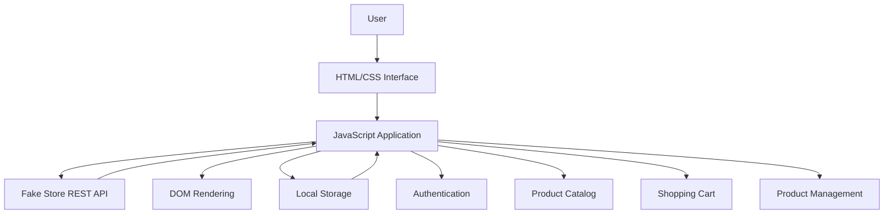

# ShopSphere — Production Capstone Web App

ShopSphere is a responsive e-commerce web application developed as a production capstone project. It demonstrates authentication simulation, REST API integration, interactive product browsing, CRUD operations, shopping cart management, and persistent browser state.

## 🚀 Features

* Simulated user login and logout
* Product catalog loaded from a REST API
* Product search
* Category filtering
* Price and name sorting
* Add products to shopping cart
* Remove individual cart items
* Clear shopping cart
* Add custom products
* Delete products
* Persistent login and cart data using `localStorage`
* Responsive layout for desktop and mobile devices
* Error handling for failed API requests

## 🏗️ Architecture



## 🛠️ Technologies Used

* HTML5
* CSS3
* JavaScript
* REST API
* Fetch API
* Browser Local Storage
* GitHub Pages

## 📂 Project Structure

```text
production-capstone-web-app/
│
├── index.html
├── style.css
├── script.js
└── README.md
```

## ⚙️ How to Run

1. Clone or download the repository.
2. Open `index.html` in a modern web browser.
3. The application loads product data from the REST API.
4. Use the login, search, filtering, sorting, cart, and product management features.

## 🔐 Persistent State

ShopSphere uses browser `localStorage` to persist:

* Logged-in username
* Shopping cart items

This allows important user state to remain available after refreshing the page.

## 🌐 Live Deployment

The application is deployed using GitHub Pages.

**Live URL:**
`https://anshikasaxena50.github.io/production-capstone-web-app/`

## 📌 Project Highlights

This project demonstrates practical front-end development concepts including:

* DOM manipulation
* Event-driven JavaScript
* RESTful API consumption
* Dynamic CRUD operations
* Client-side state management
* Local data persistence
* Responsive web design
* Error handling
* Cloud deployment

## 👩‍💻 Developer

**Anshika Saxena**
BTech Computer Science & Engineering
